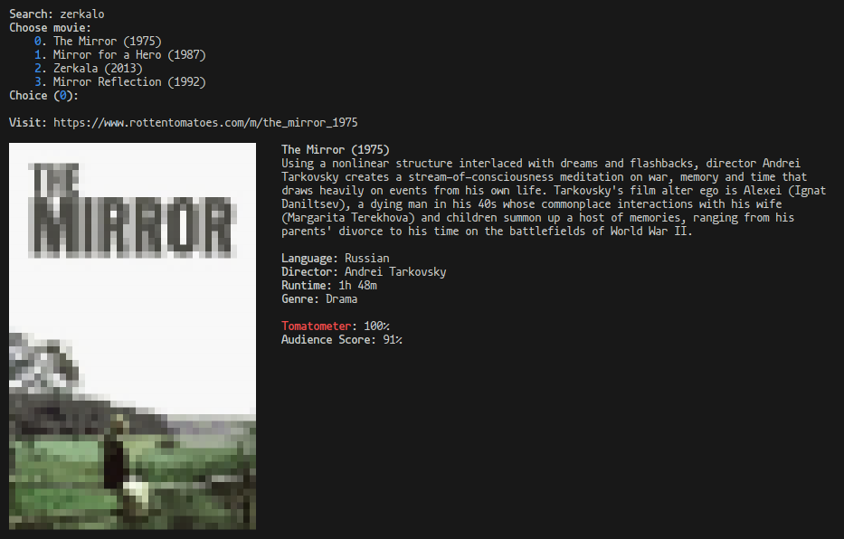

# movieinfo
**Get movie info in the terminal**

# Dependencies
`catimg`: for default mode  
`asciiart`: for ASCII art [-a] mode  
**None**: for no image [-n] mode

# Installation
To install systemwide, run:

    sudo wget https://raw.githubusercontent.com/gmou3/movieinfo/main/movieinfo.sh -O /usr/bin/movieinfo
    sudo chmod a+rx /usr/bin/movieinfo
(Alternatively, you can simply download and run the script `movieinfo.sh`.)

# Usage
movieinfo [flags]

flags:  
   -a: ASCII art image using `asciiart` (instead of default `catimg`)  
   -n: no image
