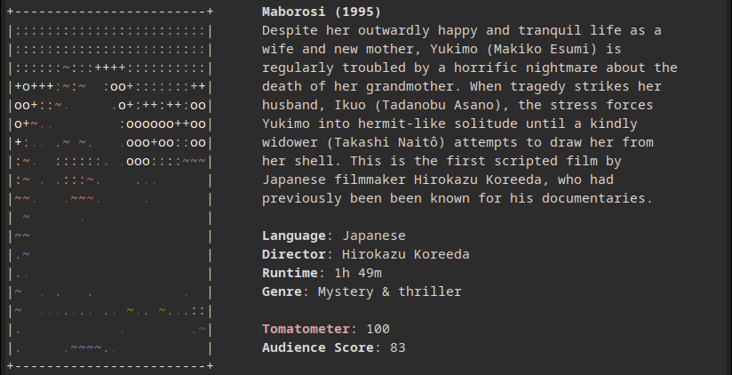

# movieinfo
Get movie info in the terminal

# Dependencies
asciiart  (for default mode)  
catimg  (for realistic [-r] mode)  
 —  (for no image [-n] mode)

# Usage
./movieinfo.sh [flags]

flags:  
   -r: realistic image using catimg (instead of default asciiart)  
   -n: no image
