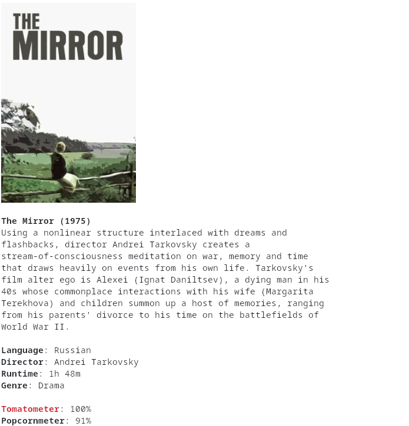

# movieinfo
**Get movie info in the terminal**

# Dependencies
`chafa`: for default mode  
`catimg`: for catimg mode [--catimg]  
`asciiart`: for ASCII art mode [--asciiart]  
**None**: for no image mode [--no-image]

# Installation
To install systemwide, run:

    sudo wget https://raw.githubusercontent.com/gmou3/movieinfo/main/movieinfo.sh -O /usr/bin/movieinfo
    sudo chmod a+rx /usr/bin/movieinfo
(Alternatively, you can simply download and run the script `movieinfo.sh`.)

# Usage
movieinfo [flags]

flags:  
   --catimg: image using catimg  
   --asciiart: ASCII art image using `asciiart`  
   --no-image: no image
